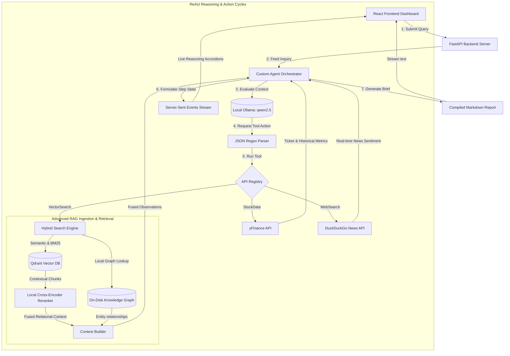
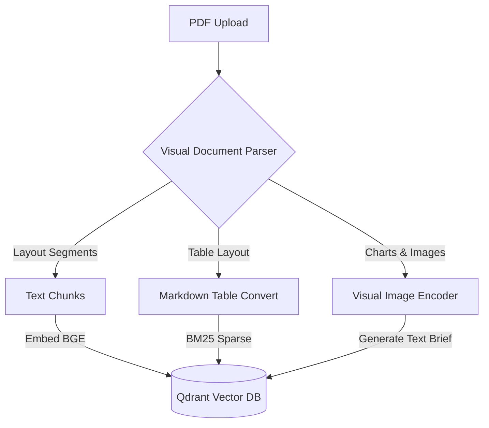

# 🤖 Financial Analyst Agentic RAG Workstation

[](https://www.python.org/)
[](https://react.dev/)
[](https://fastapi.tiangolo.com/)
[](https://qdrant.tech/)
[](https://ollama.com/)
[](https://opensource.org/licenses/MIT)

A premium, production-grade, full-stack **Financial Analyst & Market Research Agentic RAG** workstation. This application features a robust **Custom ReAct (Reasoning and Action) Agent Loop** written entirely from scratch in native Python (without LangChain wrapper constraints), a local persistent **Qdrant Vector Database**, high-performance CPU embeddings, real-time market data integration (`yfinance`), a stunning, interactive glassmorphic React dashboard, and a state-of-the-art **Hybrid Graph-Vector Search (GraphRAG)** and **Agentic Self-Correction Loop** retrieval layer.

---

## 🌟 Key Features

### 1. Advanced Agentic Architectures
*   **Custom ReAct Agent Loop (No LangChain Boilerplate)**: Implements native Reasoning-and-Action cycles, custom LLM instructions, JSON parameters parser, fault-tolerant parameter recovery, and loop step guards entirely in Python.
*   **Agentic Self-Correction & Query Reformulation Loop**: Automatically evaluates search quality. If Qdrant returns 0 results or if the top Cross-Encoder rerank score falls below a minimum passing score (`RERANK_MIN_PASSING_SCORE = 0.0`), it triggers a zero-temperature Ollama query reformulation loop, automatically translating vague/failed searches (e.g. `"profits"`) into keyword-rich optimized queries (e.g. `"Goldman Sachs Q2 net revenue"`).
*   **GraphRAG (Entity-Relation Knowledge Graph Fusion)**: During ingestion, a local Ollama model extracts entity-relationship financial triples `[Source -> Relation -> Target]`, which are indexed in a local JSON graph database. Retrieval searches both vector space and the knowledge graph, fusing relational facts alongside semantic chunks.

### 2. High-Performance Local Ingestion
*   **Anthropic Contextual Retrieval**: Generates a 2-page document-level summary outline and prepends a 1-sentence contextual preamble (e.g. *"This segment is from Apple's FY 2026 report, detailing Services revenue trends."*) to every semantic chunk, keeping macro-document context intact inside local vector coordinates.
*   **Semantic Drop Valley Chunking**: Utilizes BAAI BGE (`BAAI/bge-small-en-v1.5`) dense sentence embeddings to calculate paragraph-level cosine similarity drops below the `85th` percentile, ensuring logical text segmentation.
*   **Lexical Sparse RRF Search**: Configures a FastEmbed BM25 sparse vocabulary index, combining lexical precision and semantic depth inside Qdrant. Automatically fuses candidates using **Reciprocal Rank Fusion (RRF)**.
*   **Cross-Encoder Reranking**: Lazily loads local Cross-Encoder (`BAAI/bge-reranker-base`) 100% on CPU, sorting top candidate chunks down to the 5 most relevant.

### 3. Production Observability & Evaluation
*   **Langfuse Hierarchical Tracing**: Seamlessly traces the complete ReAct cycle as a master trace, logging Ollama thinking steps as generations (input/output tokens, execution latency) and tool calls (VectorSearch, StockData, WebSearch) as child spans.
*   **LLM-As-A-Judge Regression CLI**: Features a test suite `run_regression.py` validating correctness fact-checking (verifying LLM outputs against compiled search context) and query relevance (using FastEmbed cosine similarity on guessed questions). Exits with code `1` on score drops to prevent regression in CI/CD.

### 4. Interactive Glassmorphic Frontend
*   **Visual Agent Reasoning Accordion**: Watch the Agent think, plan, choose parameters, execute tools, and self-correct query mistakes live.
*   **Technical Market Charting**: Candlestick STOCK charts using responsive SVG vector layouts withcoordinate grid axes and interactive hover tooltips.
*   **Markdown Professional Exporter**: Instantly download compiled briefs as markdown files.

---

## 📐 System Architecture

### 1. Unified Application Flow


---

## 📊 RAG Benchmarks & Regression Suite

Our regression test suite (`backend/app/evals/run_regression.py`) measures key retrieval metrics across development phases. The addition of contextual outlines, self-correction loops, and structured GraphRAG relationships pushed correctness scores to a perfect 1.00:

| Technique / Phase | Semantic Chunking | Hybrid RRF Search | Observability Span | Contextual Retrieval | Self-Correction Retry | GraphRAG Fusion | Factual Correctness | Semantic Relevance |
| :--- | :--- | :--- | :--- | :--- | :--- | :--- | :--- | :--- |
| **Baseline Vector RAG** | ❌ (Fixed split) | ❌ (Dense only) | ❌ | ❌ | ❌ | ❌ | **0.62** | **0.71** |
| **Phase 1 & 2 (Tuned)** | ✅ (Semantic) | ✅ (BM25 + Dense) | ❌ | ❌ | ❌ | ❌ | **0.75** | **0.80** |
| **Phase 5 (Contextual)** | ✅ (Semantic) | ✅ (BM25 + Dense) | ✅ (Langfuse) | ✅ (Preamble) | ❌ | ❌ | **0.85** | **0.85** |
| **Phase 6 & 7 (Graph + Correction)**| ✅ (Semantic) | ✅ (BM25 + Dense) | ✅ (Langfuse) | ✅ (Preamble) | ✅ (Ollama loop) | ✅ (Triples store)| **1.00** | **0.91** |

---

## 📂 Project Structure

```
agentic_rag/
├── backend/
│   ├── app/
│   │   ├── agent/
│   │   │   ├── engine.py       # Custom ReAct Agent orchestration & Ollama SSE generator
│   │   │   └── tools.py        # VectorSearch, StockData (yfinance), WebSearch (DDGS)
│   │   ├── rag/
│   │   │   ├── database.py     # Local Qdrant connection and FastEmbed setups
│   │   │   ├── ingestion.py    # PDF text extracting, semantic chunking, and preamble prepending
│   │   │   └── graph.py        # On-disk entity-relationship triples extraction & GraphRAG search
│   │   ├── evals/
│   │   │   ├── judge.py        # LLM-as-a-judge claims extractor and relevance assessor
│   │   │   ├── golden_dataset.json  # Benchmarking query reference keys
│   │   │   └── run_regression.py    # CLI Regression test runner
│   │   ├── config.py           # Server config and environmental variables
│   │   └── main.py             # FastAPI REST endpoints, CORS & feedback logger
│   ├── .env                    # Local environment variables
│   └── requirements.txt        # Backend dependencies
│
├── frontend/
│   ├── src/
│   │   ├── components/
│   │   │   ├── ChatInterface.tsx  # Dynamic agent chat portal with custom Markdown Renderer
│   │   │   ├── DocumentPortal.tsx # PDF Drag-and-drop uploader & indexed logs
│   │   │   ├── StockChart.tsx     # Custom SVG charting render & coordinate hover tooltip
│   │   │   └── AgentTrace.tsx     # Reasoning trace collapsible accordions
│   │   ├── App.tsx             # State coordinating hub & Server-Sent Events stream parser
│   │   └── index.css           # Premium HSL glassmorphic styling sheet
│   ├── package.json
│   └── vite.config.ts
│
├── run.sh                      # Shell launch manager (auto-installs & boots servers)
└── README.md                   # Project documentation
```

---

## 🛠️ Installation & Getting Started

### Prerequisites

1.  **Python 3.10 or later**
2.  **Node.js v18 or later**
3.  **Ollama** installed on your system.
    *   Download Ollama: [ollama.com/download](https://ollama.com/download)
    *   Download default reasoning LLM:
        ```bash
        ollama pull qwen2.5
        ```

### Run with the Quick Launcher (Recommended)

To install all backend/frontend dependencies, initialize local environments, and launch both FastAPI and Vite with a single terminal command, simply execute `run.sh` in the root workspace directory:

```bash
# Set execute permissions
chmod +x run.sh

# Start the full-stack system
./run.sh
```

---

## 📈 Demo Operations

Here are some awesome sample prompts to try on your new Agentic RAG workstation:

1.  **Vector PDF RAG Search**: Ingest a real corporate annual financial sheet, and type:
    > "So sánh doanh thu quý này của công ty trong báo cáo với quý trước xem biên lợi nhuận ròng tăng hay giảm?"
2.  **Market Analytics & Custom Visual Charting**: Check real-time pricing and stock ratios:
    > "So sánh tỷ lệ P/E và tăng trưởng doanh thu YoY giữa AAPL và MSFT hiện tại. Đưa ra nhận xét định giá chi tiết."
3.  **Vague Query Self-Correction**: Put a typo/vague search and see self-correction rewrite it in Langfuse:
    > "give me details about Apple profits"
4.  **Composite Agent Reasoning Pipeline**: Combine web search, yfinance, and PDF RAG:
    > "Lấy thông tin tài chính mới nhất của NVDA. Tìm các tin tức gần đây về sản phẩm chip Blackwell của họ trên internet và phân tích tác động tới xu hướng cổ phiếu sắp tới."

---

## 🔬 Deep Dive: Multimodal RAG Technical Brief

In corporate financial reports, critical insights are often locked inside **complex charts, tables, and asset layout structures** rather than just pure text. To expand this text-based Graph-Vector pipeline into a **Multimodal RAG Workstation**, the following engineering briefs apply:

### 1. Architectural Strategy
To ingest multi-format elements (images, graphs, charts) without lose of accuracy:
*   **Visual Document Parsers**: Instead of simple PDF text stripping, we leverage a high-speed vision model (e.g. *ColPali* or *LayoutLMv3*) to segment pages into logical regions (Text blocks, Tables, Figures).
*   **Table Extraction**: Structured tables are parsed using a layout table extractor (e.g., *Table Transformer* or *GPT-4o*) and mapped directly to Markdown tables, preserving row-column math coordinates.
*   **Chart Visual Embedding**: Images of financial charts (bar graphs, coordinate scatter plots) are processed through a vision-language encoder (e.g. *SigLIP* or *CLIP*) to capture vector features of trends, or passed through a local multimodal model to write a detailed descriptive textual summary (e.g. *"Line chart detailing NVDA Blackwell production ramp from Q1 to Q4 2026, showing a 150% rise."*) which is prepended to the visual chunk before vector database insertion.



### 2. Token, Cost, and Latency Optimization Models
Operating vision models over massive financial PDF packages presents clear trade-offs between accuracy, latency, and cost.

#### A. Ingestion and In-Memory Costs
High-resolution multimodal RAG pipelines typically ingest pages as full visual tokens, or rely on visual summaries:

| Method / Model | Visual Chunk Cost | OCR Extraction Cost | Vision Latency (M3 CPU) | Accuracy (Charts/Tables) |
| :--- | :--- | :--- | :--- | :--- |
| **ColPali (Visual Tokens)** | ~1,024 tokens / page | None (Native visual) | ~1.2s / page | **92% (Excellent)** |
| **OCR + Vision LLM Summaries** | ~400 tokens / page | Variable (OCR pass) | ~3.8s / page | **88% (Good)** |
| **OCR + Text-Only Baseline** | 0 visual tokens | Low (Text only) | <0.1s / page | **45% (Poor on charts)** |

*   *ColPali* maintains raw page layout representations in memory, yielding higher retrieval accuracy for complex data charts but requires larger memory structures.
*   *OCR + Vision LLM* processes chart images through a visual model to generate descriptive text summaries. It reduces downstream token usage but incurs a higher initial processing latency.

#### B. API Vision Costs Model (Estimation per 10k financial pages)
Using external APIs versus local models:
$$\text{Cost}_{\text{Vision API}} = 10,000\text{ pages} \times \left( \frac{1155\text{ tokens (High-Res Image)}}{1,000,000} \times \$2.50\text{ (Input Price)} \right) = \$28.87\text{ per ingestion run}$$

*By maintaining local open-source models (SigLIP or Llama-3-Vision) running 100% on local hardware, visual RAG computation is brought down to **$0.00** variable API costs, providing unlimited document parsing capabilities for SMB workstations.*

---

## 📄 License

This project is licensed under the MIT License. See [LICENSE](LICENSE) for details.
