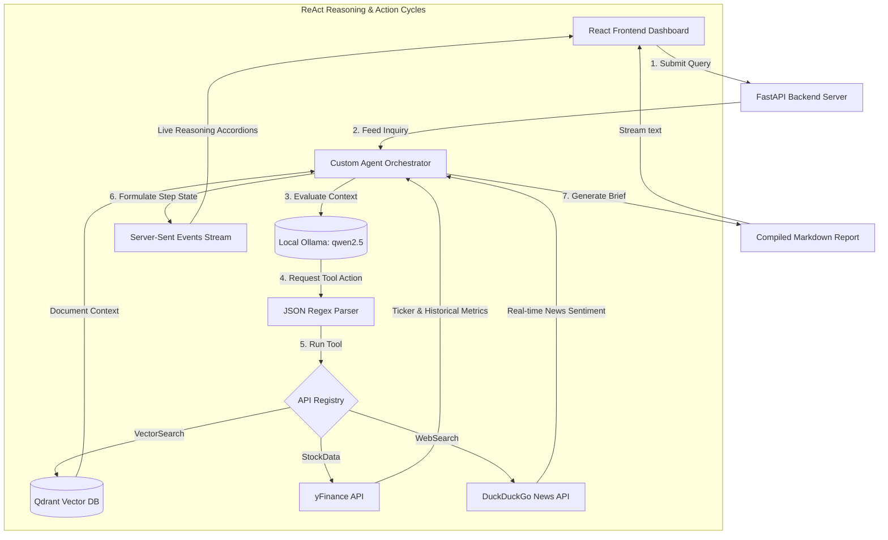
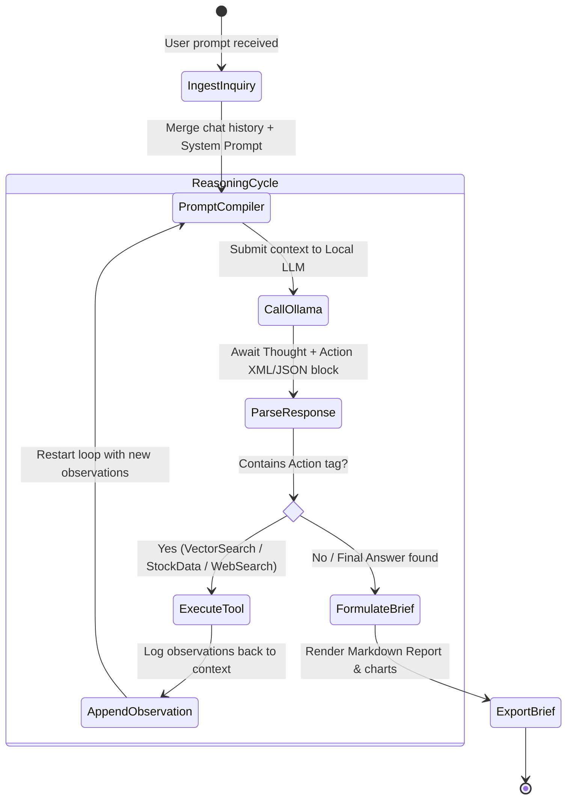

# 🤖 Financial Analyst Agentic RAG

[](https://www.python.org/)
[](https://react.dev/)
[](https://fastapi.tiangolo.com/)
[](https://qdrant.tech/)
[](https://ollama.com/)
[](https://opensource.org/licenses/MIT)

A premium, production-ready, full-stack **Financial Analyst & Market Research Agentic RAG** workstation. This application features a robust **Custom ReAct (Reasoning and Action) Agent Loop** written entirely from scratch in native Python (without LangChain wrapper constraints), a local persistent **Qdrant Vector Database**, high-performance CPU embeddings, real-time market data integration (`yfinance`), and a stunning, interactive glassmorphic React dashboard with visual agent execution tracing and responsive pricing charts.

---

## 🌟 Key Features

*   **Custom ReAct Agent Loop (No LangChain Boilerplate)**: Implements native Reasoning-and-Action cycles, custom LLM instructions, JSON parameters parser, fault-tolerant parameter recovery, and loop step guards entirely in Python.
*   **Visual Agent Reasoning Accordion**: Renders a step-by-step thinking trace directly in the frontend chat bubbles. Reviewers can watch the Agent plan, choose parameters, execute tools (Vector Search, Yahoo Finance, Web News), and synthesize results live.
*   **High-Performance Local RAG Pipeline**: Ingests financial PDF sheets (such as Apple 10-K or Tesla Earnings), extracts text, chunks recursively, and indexes vectors into a local disk-based **Qdrant** client utilizing high-performance CPU embedding models (`fastembed` with ONNX runtime).
*   **Technical Market Charting & Fundamentals**: Fetches real-time valuations, margins, debt metrics, and price history via `yfinance`. Features a responsive, customized interactive SVG candlestick-style stock chart with coordinate grid Y-axes and hover cursor price tooltips.
*   **Internet Sentiment Integration**: Integrates real-time DuckDuckGo web search tools to capture macroeconomic movements, news alerts, and general knowledge that occurs after the document publication dates.
*   **Professional Report Exporter**: Formats investment briefings in beautiful markdown grids and provides one-click exports (`.md` files) for local download.
*   **Luxury Dark Theme Design**: A state-of-the-art UI utilizing custom HSL color systems, drop shadows, responsive dashboard grids, blur backdrops, and subtle micro-animations.

---

## 📐 System Architecture

### 1. Unified Application Flow


### 2. Custom Agent Reasoning State Machine


---

## 📂 Project Structure

```
agentic_rag/
├── backend/
│   ├── app/
│   │   ├── agent/
│   │   │   ├── engine.py       # Custom ReAct Agent orchestration & Ollama SSE generator
│   │   │   └── tools.py        # VectorSearch, StockData (yfinance), WebSearch (DDGS)
│   │   ├── rag/
│   │   │   ├── database.py     # Local Qdrant connection and FastEmbed setups
│   │   │   └── ingestion.py    # PDF text extracting, chunking, and vector indexing
│   │   ├── config.py           # Server config and environmental fallbacks
│   │   └── main.py             # FastAPI REST endpoints & CORS middlewares
│   ├── .env                    # Local environment variables
│   └── requirements.txt        # Backend dependencies (fastapi, qdrant-client, yfinance, fastembed)
│
├── frontend/
│   ├── src/
│   │   ├── components/
│   │   │   ├── ChatInterface.tsx  # Dynamic agent chat portal with custom Markdown Renderer
│   │   │   ├── DocumentPortal.tsx # PDF Drag-and-drop uploader & indexed logs
│   │   │   ├── StockChart.tsx     # Custom SVG charting render & coordinate hover tooltip
│   │   │   └── AgentTrace.tsx     # Reasoning trace collapsible accordions
│   │   ├── App.tsx             # State coordinating hub & Server-Sent Events stream parser
│   │   └── index.css           # Premium HSL styling sheet (glassmorphic layouts)
│   ├── package.json
│   └── vite.config.ts
│
├── run.sh                      # Shell launch manager (auto-installs & boots servers)
└── README.md                   # Project documentation
```

---


## 🛠️ Installation & Getting Started

### Prerequisites

1.  **Python 3.10 or later**
2.  **Node.js v18 or later**
3.  **Ollama** installed on your system.
    *   Download Ollama: [ollama.com/download](https://ollama.com/download)
    *   Download default reasoning LLM:
        ```bash
        ollama pull qwen2.5
        ```

### Run with the Quick Launcher (Recommended)

To install all backend/frontend dependencies, initialize local environments, and launch both FastAPI and Vite with a single terminal command, simply execute `run.sh` in the root workspace directory:

```bash
# Set execute permissions (if not already set)
chmod +x run.sh

# Start the full-stack system
./run.sh
```

### Manual Installation Steps (Optional)

#### 1. Setup Backend Server
```bash
cd backend
python3 -m venv venv
source venv/bin/activate
pip install -r requirements.txt
python -m uvicorn app.main:app --reload --host 0.0.0.0 --port 8000
```
API Documentation will be accessible at: [http://localhost:8000/docs](http://localhost:8000/docs)

#### 2. Setup Frontend Client
```bash
cd frontend
npm install
npm run dev
```
Giao diện người dùng sẽ sẵn sàng tại: [http://localhost:5173](http://localhost:5173)

---

## 📈 Demo Operations

Here are some awesome sample prompts to try on your new Agentic RAG workstation:

1.  **Vector PDF RAG Search**: Ingest a real corporate annual financial sheet, and type:
    > "So sánh doanh thu quý này của công ty trong báo cáo với quý trước xem biên lợi nhuận ròng tăng hay giảm?"
2.  **Market Analytics & Custom Visual Charting**: Check real-time pricing and stock ratios:
    > "So sánh tỷ lệ P/E và tăng trưởng doanh thu YoY giữa AAPL và MSFT hiện tại. Đưa ra nhận xét định giá chi tiết."
3.  **Composite Agent Reasoning Pipeline**: Combine web search, yfinance, and PDF RAG:
    > "Lấy thông tin tài chính mới nhất của NVDA. Tìm các tin tức gần đây về sản phẩm chip Blackwell của họ trên internet và phân tích tác động tới xu hướng cổ phiếu sắp tới."

---

## 📄 License

This project is licensed under the MIT License. See [LICENSE](LICENSE) for details.
